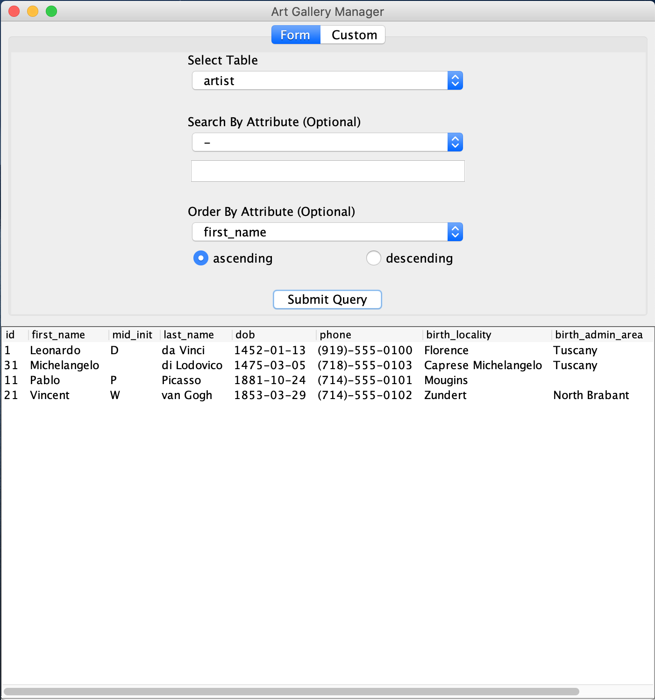
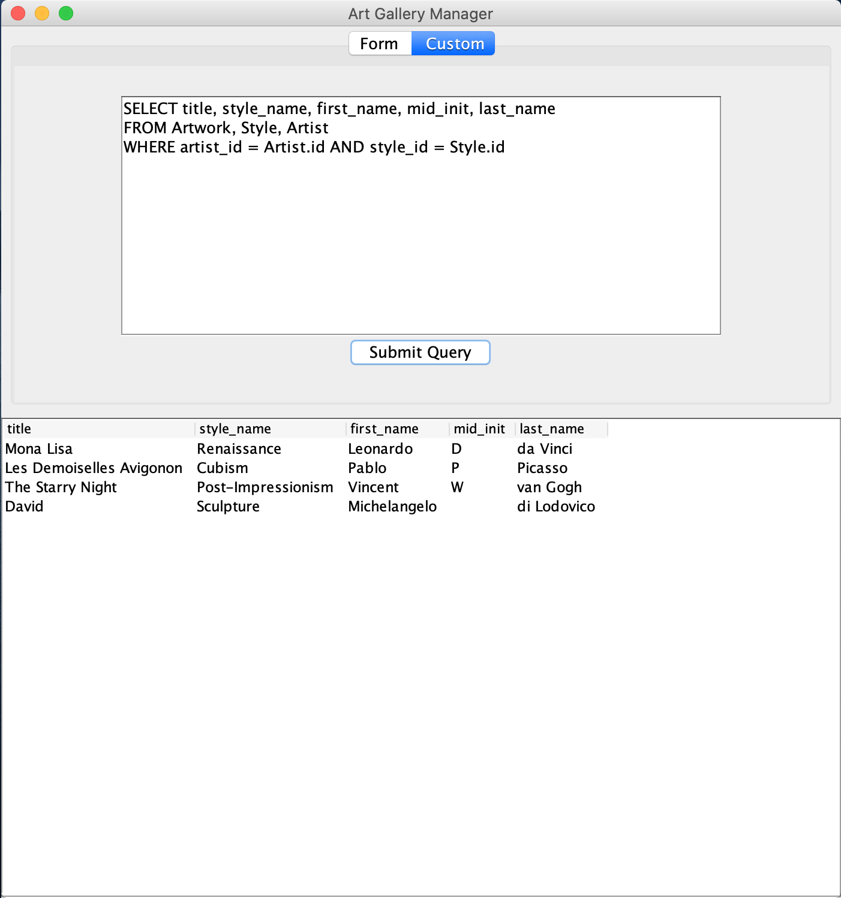

## Summary

A desktop application used to query a database for art gallery data such as art shows, artists, and artwork. This project is written in Java using Swing to create the user interfaces. It connects to a MySQL database using the Connector/J API. The database is hosted by ClearDB's services, and was set up through Heroku. Source code for setting up the database is also included.

This project builds with Maven. Please see pom.xml for dependencies and version numbers. 

If you would like to test the project, feel free to download the jar file inside the "target" directory.

## Demo Screenshots

Some demo screenshots showing a form-based query and a custom query.

 

The JTable resizes to accomodate the search results, and stores the results and dimensions for all tabs.
